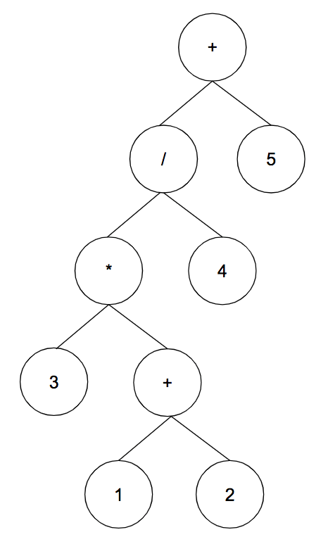

## Functional Programming vs Sequence Programming

#### ichi

---
@title[Introduction - 1]

* Function Language
  * a programming language
  * fit some requests: no side effects, lazy...
* Functional Programming
  * a style of building the structure

---
@title[Introduction - 2]

* What problem could be solved by functional ◯ ◯ ◯ ?
  * functional language
  * functional programming

+++

### Functional Language

Suppose it is true that there is a problem which be solved only by functional language

Proof:

<pre class="proof">

If a problem is solved only by functional language $\rightarrow$ there is no language to solve it.

$\forall$ functional language $\in$  interpreted $\exists$ a interpreter to handle

$\forall$ interpreter generates a machine language to run

$\therefore \not\exists$ a problem could be solved only by functional language

</pre>

+++

### Functional Language

* data type (as a set)
  * number, string, boolean
* syntax
  * operator: $\+\-\times\div\&\|\!\%$ ...
  * condition
  * loop

+++?image=assets/images/graph.png&size=auto 80%&position=bottom

### Functional Programming

---
@title[Introduction - 3]

* Performance
  * language: compiled vs interpreted
  * programming

---
@title[Difference - 1]

### create todoList as an example

* item.description.length > 0
* item.description.length <= 20
* uncomplete items.length <= 10

+++

### Sequence Programming

+++

### Functional Programming

---
@title[Difference - 2]

### Expression Tree

@snap[west sidebar]

@snapend

@snap[east sidebar]
  <h4>Tree Traversal</h4>
  @ul
    * infix: <pre>1 + 1</pre>
    * prefix: <pre>+ 1 1</pre>
    * postfix: <pre>1 1 +</pre>
  @ulend
@snapend

+++

@snap[west sidebar]

@snapend

@snap[east sidebar]
  <h4>Tree Traversal</h4>
  @ul
    * infix: <pre>3 \* (1 + 2) / 4 + 5</pre>
    * prefix: <pre>+ / \* 3 + 1 2 4 5</pre>
  @ulend
@snapend
