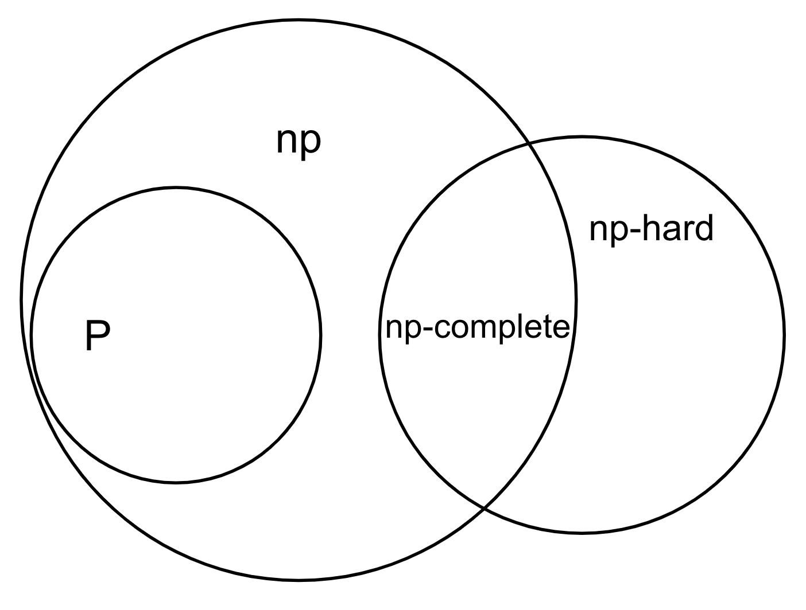
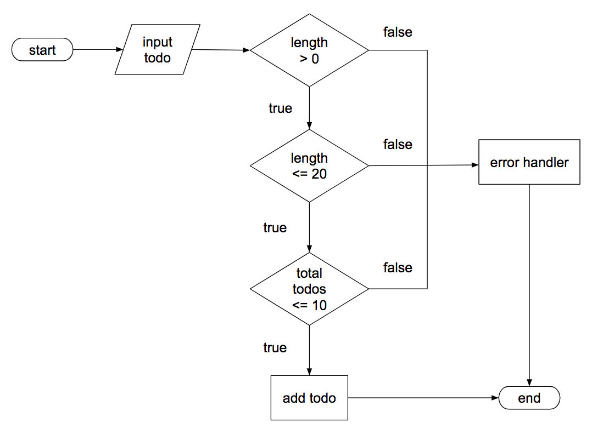
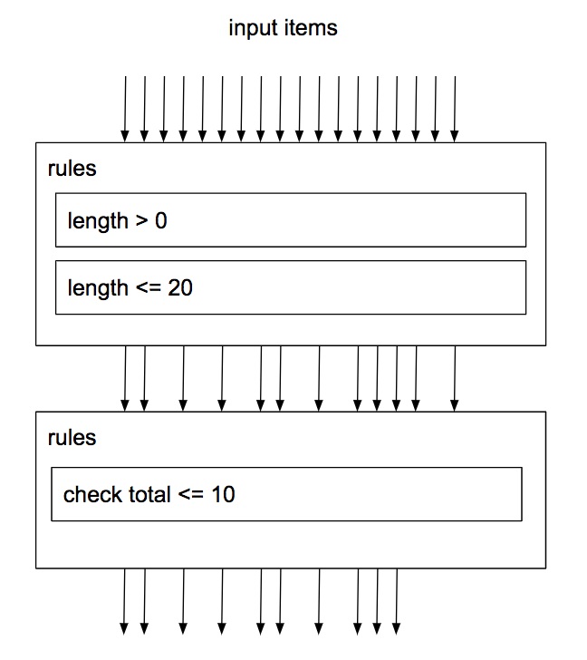
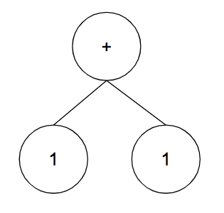

<!-- _class: cover-slide -->
# Functional Programming vs Sequence Programming
### ichi

---

## Introduction - 1

* Functional Language
  * a programming language
  * fit some requirements: no side effects, lazy...
* Functional Programming
  * a style of building the structure
  * function first

---

## Introduction - 2

* What problem could be solved by functional ◯ ◯ ◯ ?
  * functional language
  * functional programming

---

## what problem - functional language (1)

Proof:

Suppose it is true that there is a problem which be solved only by functional language  

If a problem is solved only by functional language $\rightarrow$ there is no language to solve it. 

$\forall$ functional language $\in$  interpreted $\exists$ a interpreter to handle 

$\forall$ interpreter generates a machine language to run 

$\therefore \not\exists$ a problem could be solved only by functional language

---

## what problem - functional language (2)

* data type (as a set)
  * number, string, boolean
  * function
* syntax
  * operator: $\+\-\times\div\&\|\!\%$ ...
  * condition
  * loop
  * function

---

## what problem - functional programming

---

## Introduction - 3

### Performance

* language: compiled vs interpreted
* [programming](#/2/3)

---
## Why

### why should we choose it

Performance is not only the reason

* familiar with it
* in the specific environment
* easy to solve problems we meet
* popular

---

## Difference - 1

### create todoList as an example

* item.description.length > 0
* item.description.length <= 20
* uncomplete items.length <= 10

---

## Sequence Programming

---

## Functional Programming

---

## Difference - 2 (Expression Tree)

  

    
  

  

    <h4>Tree Traversal</h4>
    <ul>
      <li>infix: <pre>1 + 1</pre></li>
      <li>prefix: <pre>+ 1 1</pre></li>
      <li>postfix: <pre>1 1 +</pre></li>
    </ul>
  

---

  

    
  

  

    <h4>Tree Traversal</h4>
    <ul>
      <li>infix: <pre>3 \* (1 + 2) / 4 + 5</pre></li>
      <li>prefix: <pre>+ / \* 3 + 1 2 4 5</pre></li>
    </ul>
  

---

<!-- _class: cover-slide -->
# FIN
